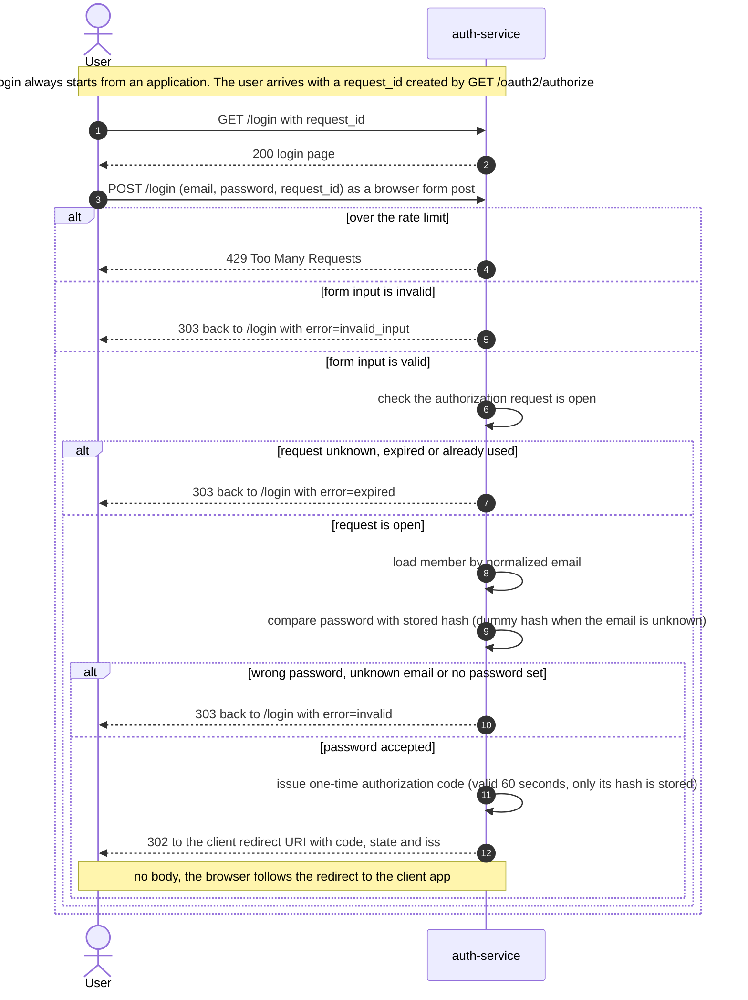

# Login Flow

Password only (there is no second factor and no account blocking). Login ends with a one-time authorization code, not tokens. See `oauth2-pkce-flow.md` for what happens next.

```mermaid
sequenceDiagram
    autonumber
    actor U as User
    participant A as auth-service

    Note over U,A: Login always starts from an application. The user arrives with a request_id created by GET /oauth2/authorize
    U->>A: GET /login with request_id
    A-->>U: 200 login page
    U->>A: POST /login (email, password, request_id) as a browser form post

    alt over the rate limit
        A-->>U: 429 Too Many Requests
    else form input is invalid
        A-->>U: 303 back to /login with error=invalid_input
    else form input is valid
        A->>A: check the authorization request is open
        alt request unknown, expired or already used
            A-->>U: 303 back to /login with error=expired
        else request is open
            A->>A: load member by normalized email
            A->>A: compare password with stored hash (dummy hash when the email is unknown)
            alt wrong password, unknown email or no password set
                A-->>U: 303 back to /login with error=invalid
            else password accepted
                A->>A: issue one-time authorization code (valid 60 seconds, only its hash is stored)
                A-->>U: 302 to the client redirect URI with code, state and iss
                Note over U,A: no body, the browser follows the redirect to the client app
            end
        end
    end
```
