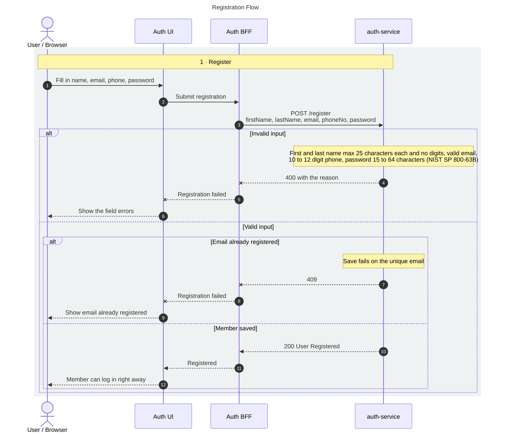

# Registration Flow

Register. There is no email verification, so the member can log in right away. See `login-flow.md` for what happens next.

```mermaid
---
title: Registration Flow
---
sequenceDiagram
    autonumber
    actor B as User / Browser
    participant UI as Auth UI
    participant BFF as Auth BFF
    participant API as auth-service

    rect rgba(150,170,170,0.15)
    Note over B,API: 1 · Register
    B->>UI: Fill in name, email, phone, password
    UI->>BFF: Submit registration
    BFF->>API: POST /register<br/>firstName, lastName, email, phoneNo, password
    alt Invalid input
        Note over API: First and last name max 25 characters each and no digits, valid email,<br/>10 to 12 digit phone, password 15 to 64 characters (NIST SP 800-63B)
        API--xBFF: 400 with the reason
        BFF--xUI: Registration failed
        UI-->>B: Show the field errors
    else Valid input
        alt Email already registered
            Note over API: Save fails on the unique email
            API--xBFF: 409
            BFF--xUI: Registration failed
            UI-->>B: Show email already registered
        else Member saved
            API-->>BFF: 200 User Registered
            BFF-->>UI: Registered
            UI-->>B: Member can log in right away
        end
    end
    end
```
